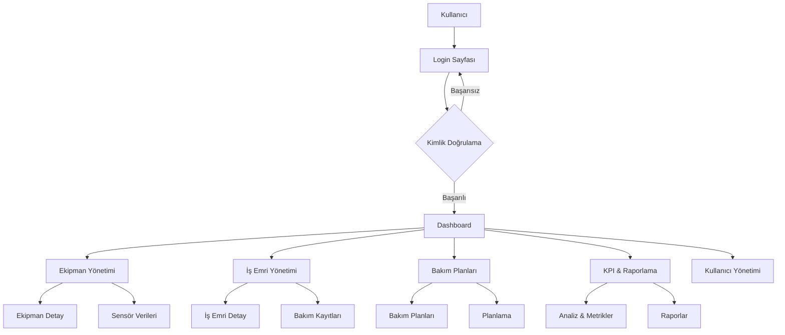
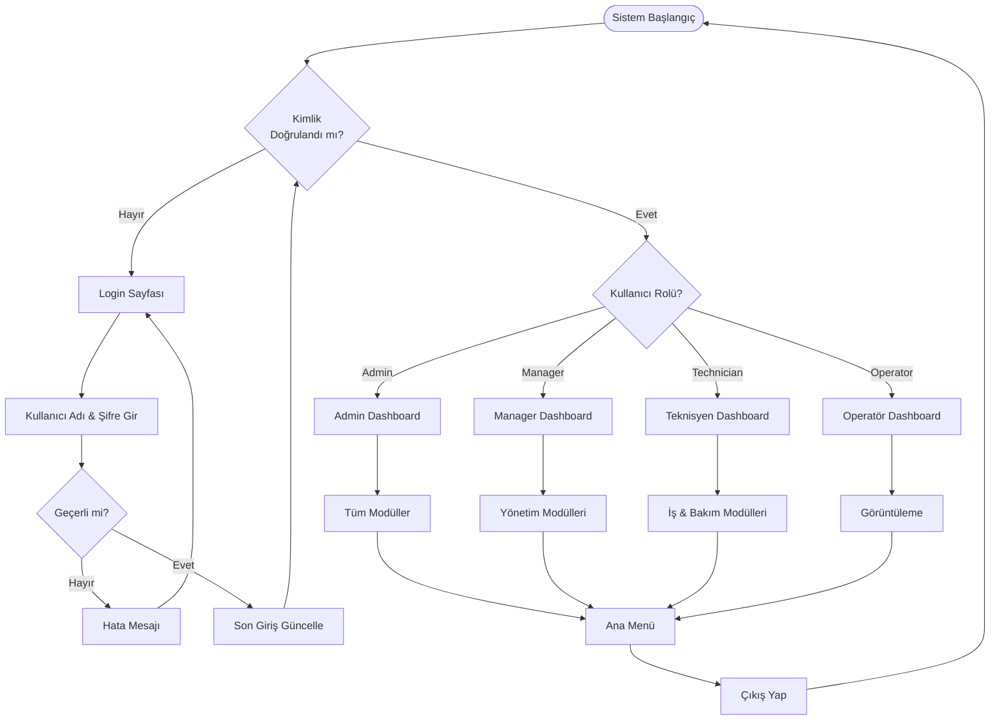
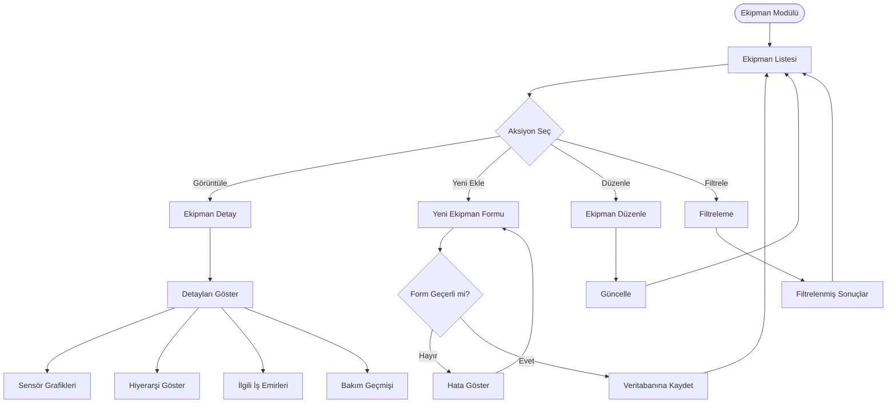
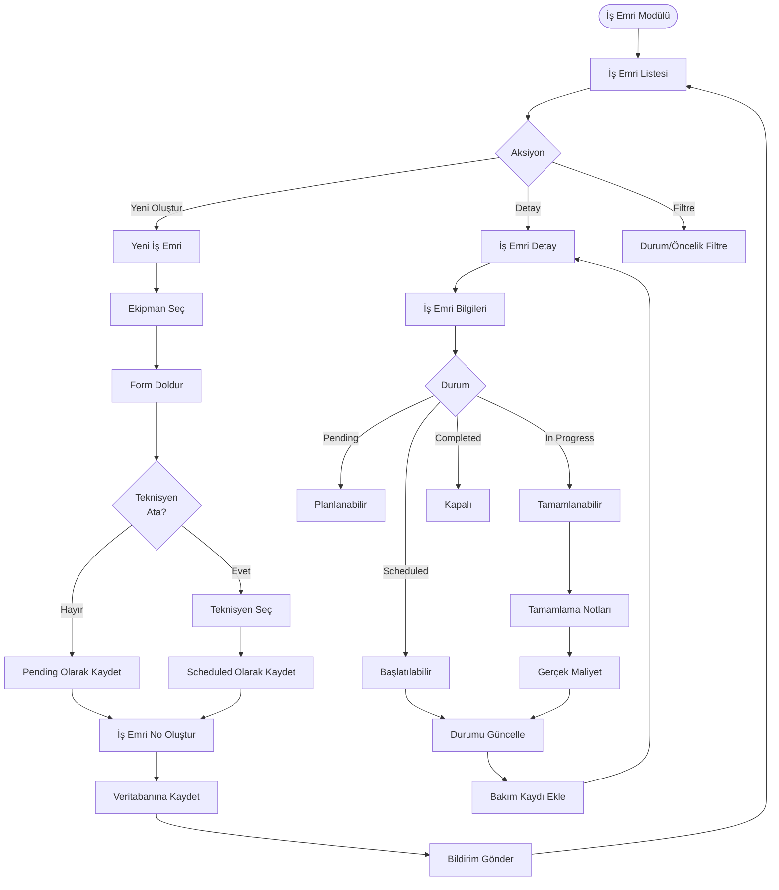
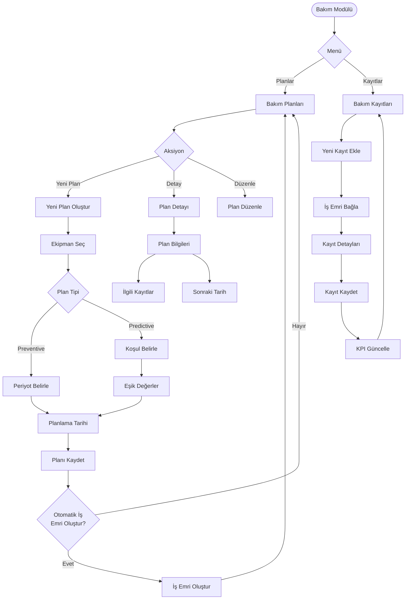
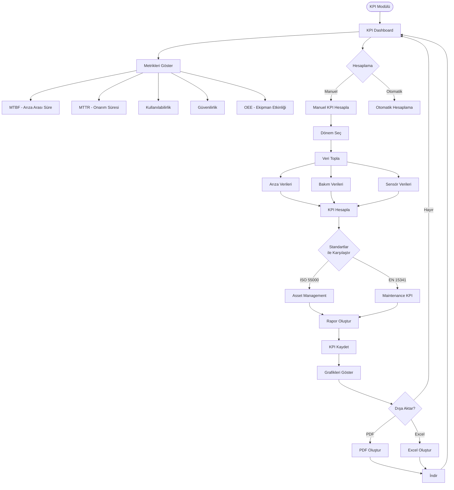
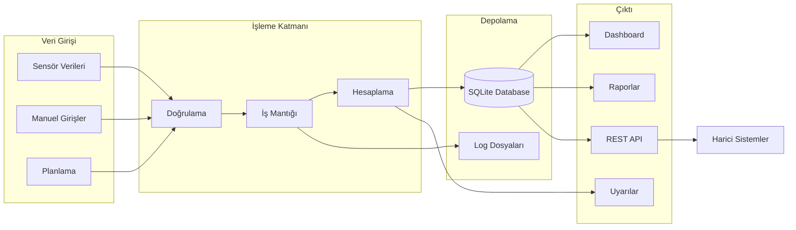
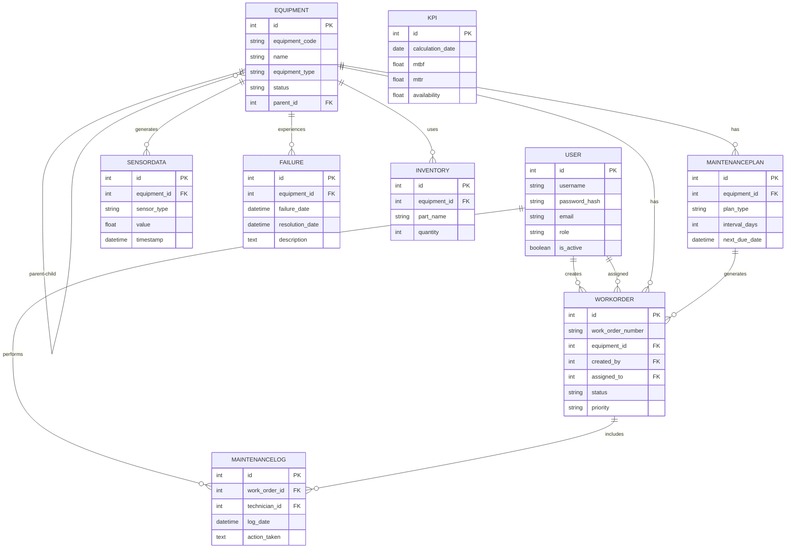
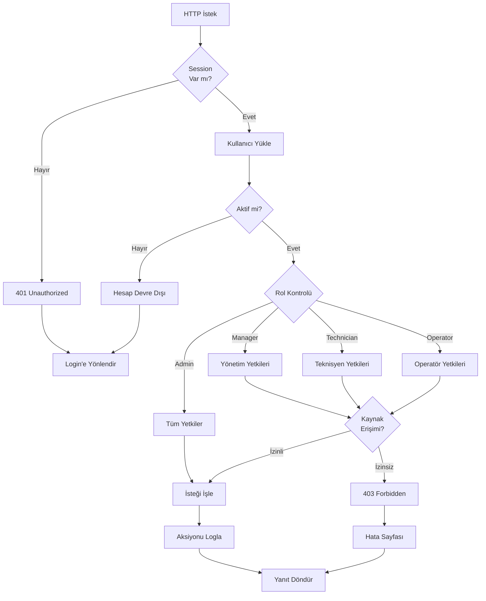

# CMMS Sistem Flowchart

## 1. Genel Sistem Mimarisi



## 2. Kullanıcı Akış Şeması



## 3. Ekipman Yönetimi İş Akışı



## 4. İş Emri İş Akışı



## 5. Bakım Planlama İş Akışı



## 6. KPI & Analiz İş Akışı



## 7. Veri Akışı Diyagramı



## 8. Database İlişki Şeması



## 9. Güvenlik & Yetkilendirme Akışı



## 10. API Endpoint Akışı

```mermaid
flowchart LR
    subgraph API [REST API Endpoints]
        Auth[/api/auth]
        Equip[/api/equipment]
        WO[/api/workorders]
        Sensor[/api/sensors]
        KPIEnd[/api/kpi]
    end
    
    subgraph Operations [Operasyonlar]
        GET[GET - Listele/Getir]
        POST[POST - Oluştur]
        PUT[PUT - Güncelle]
        DELETE[DELETE - Sil]
    end
    
    subgraph Response [Yanıtlar]
        Success[200/201 Success]
        BadRequest[400 Bad Request]
        Unauthorized[401 Unauthorized]
        NotFound[404 Not Found]
        ServerError[500 Server Error]
    end
    
    Auth --> GET
    Auth --> POST
    
    Equip --> GET
    Equip --> POST
    Equip --> PUT
    Equip --> DELETE
    
    WO --> GET
    WO --> POST
    WO --> PUT
    
    Sensor --> GET
    Sensor --> POST
    
    KPIEnd --> GET
    
    GET --> Success
    POST --> Success
    PUT --> Success
    DELETE --> Success
    
    GET -.-> NotFound
    POST -.-> BadRequest
    PUT -.-> NotFound
    DELETE -.-> NotFound
    
    Auth -.-> Unauthorized
    
    GET -.-> ServerError
    POST -.-> ServerError
```

---

## Notlar:

- **ISO 55000**: Asset Management standardına uygun yapı
- **EN 15341**: Bakım KPI'ları standardına uyumlu metrikler
- **ISO 27001**: Güvenlik ve yetkilendirme kontrolleri
- **Sensör Verileri**: Real-time veri akışı ile Digital Twin konsepti
- **Otomatik İş Emirleri**: Bakım planlarından otomatik oluşturulma
- **Rol Tabanlı Erişim**: Admin, Manager, Technician, Operator rolleri
- **Traceability**: Tüm işlemler loglanır ve izlenebilir

